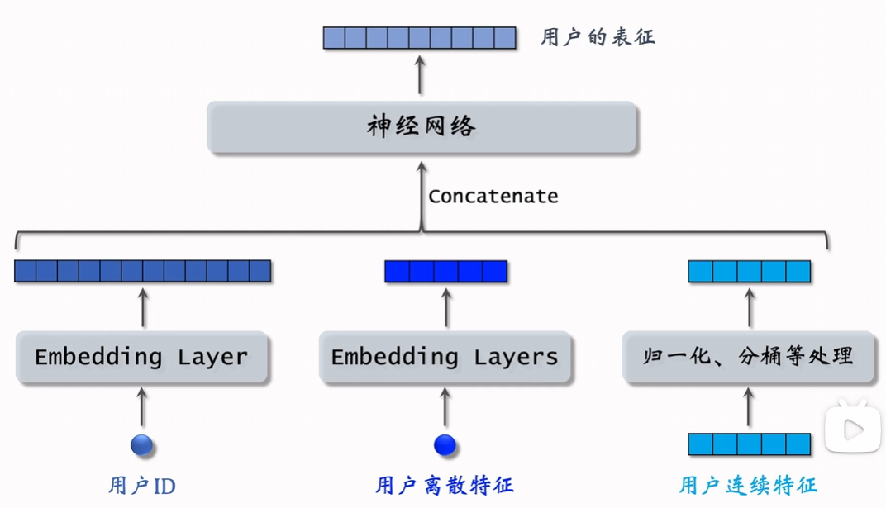
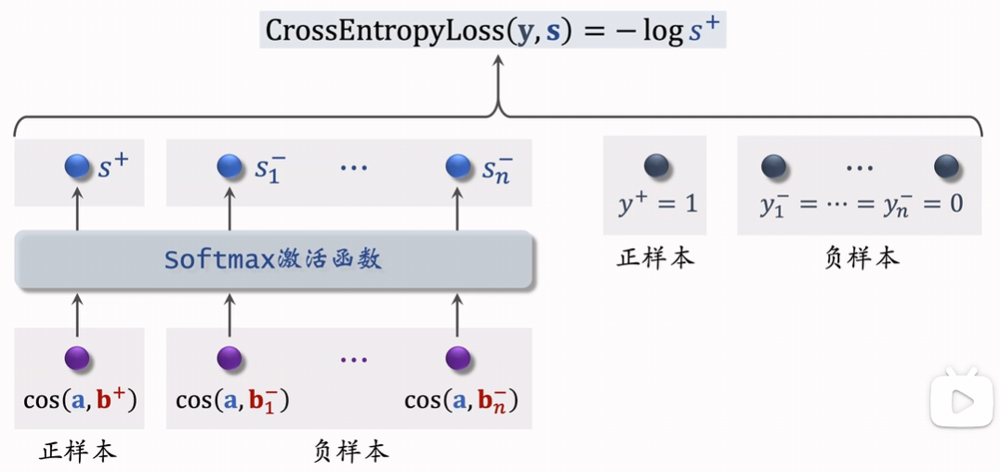
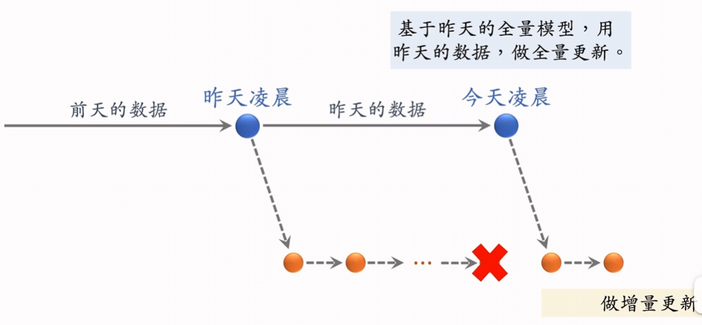

# 双塔模型
处理不同的属性和特征，从而得到用户和物品更细致的描述，其余和矩阵补充相似

训练方式：
- Pointwise：独立看待每个正负样本，做简单二元分类
  - 正负样本1：2或1：3
  - 正样本余弦相似度接近1，负样本接近-1
- Pairwise：每次取一个正样本和负样本
  - 两个物品样本共享相同的网络参数，让正样本余弦相似度大于负样本
  - 设定如果$cos(a,b^+) > cos(a,b^-)+m$就没有损失
  - Triplet hinge loss: $L(a,b^+,b^-)=\max(0,cos(a,b^-)+m-cos(a,b^+))$
  - Triplet logistic loss: $L(a, b^+, b^-)=\log(1+\exp[\sigma(\cos(a,b^-)-\cos(a,b^+))])$
- Listwise：每次取一个正样本，多个负样本
  - 

前期特征融合的模型不适用于召回，例如在输入神经网络前将两个向量拼接在一起，由神经网络得到用户对物品的兴趣。这样的模型一般是用于排序的，因为需要将用户向量与每个物品向量拼接并送入模型，召回无法承担将模型跑这么多次。

## 正负样本
正样本：曝光且有点击的用户-物品二元组，需要对冷门物品过采样或对热门物品降采样，防止热门物品大多数是热门物品

负样本：
- 没有被召回（简单负样本）
  - 直接从全体物品中进行抽样作为负样本
    - 由于样本数很多，所以未被召回的可近似于全体物品
    - 均匀抽样：对冷门物品不公平，负样本大多是冷门物品
    - 非均匀抽样：抽样概率于热门程度正相关，抽样概率正比于点击次数的0.75次方
  - Batch内负样本
    - 将同一个batch中其他正样本的物品作为负样本，但是这样相当于对热门物品以点击次数进行抽样，没有加0.75次方，解决策略是训练时使用$\cos(a,b_i)-\log p_i$，在线召回时不需要后一项
- 召回了但在粗排和精排中被淘汰，没有被曝光（困难负样本）
- 被曝光但是没有被用户点击
  - 无法应用于召回模型训练，这是用于训练排序模型的

## 线上召回

用户塔在线计算，物品塔预先计算并将向量存储在数据库中，例如Milvus、Faiss和HnswLib。
如果对用户塔也预计算效果并不好，因为欸用户兴趣是动态变化的，而物品特征相对稳定。

## 模型更新

全量更新：每天凌晨用昨天全天数据训练模型，初始参数是昨天的旧模型参数，随机打乱后用数据训练1个epoch，对数据流和系统的要求较低。

增量更新：用户兴趣随时发生变化，实时收集线上数据，做流式处理，生成TFRecord文件。
online learning，只增量更新用户embedding参数，而且更新的参数并不用于全量更新。

增量更新只使用短时间数据，存在较大偏差，而全量更新random shuffle了一天的数据，可以得到更优的训练结果。

## 自监督学习训练 物品塔

- Random Mask
- Dropout
- 互补特征
- Mask一组关联特征

# Deep Retrieval召回

## Beam Search (贪心算法)

# 地理位置召回

GeoHash召回

同城召回

# 作者召回

# 曝光过滤

看过某个物品，就不再把该物品曝光给用户

boom filter