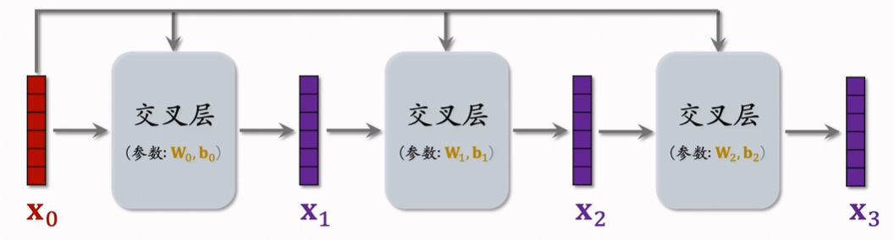
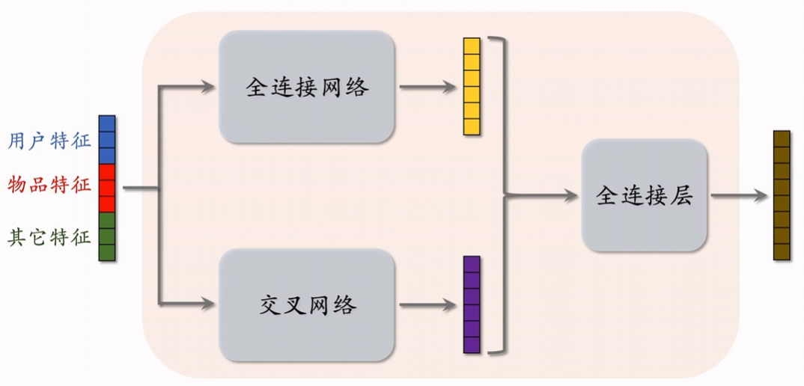

# Factorized Machine (FM) 因式分解机

线性模型中只是特征的线性组合，没有特征之间的交互

二阶特征交叉，参数量是平方级别，为了降低参数量，使用矩阵的低秩分解，就得到FM模型，只有kd个参数

现在已经被淘汰

# DCN 深度交叉网络

用于代替简单的全连接网络

# LHUC (PPNet)

只能用于精排

# SENet 和 Bilinear 交叉

SENet对特征做